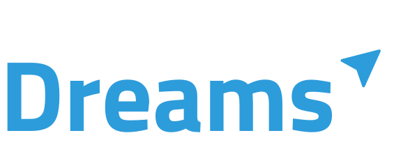

<p align="center">
  
</p>


Dreams é um Projeto de Conclusão de Curso tem como objetivo aprofundar e por em prática alguns padrões de projetos listados pelos autores como Chris Richardson, Sam Newman, Marin Fowler, entre outros. No contexto da arquitetura de microsserviços.

No decorrer do artigo faço uso desta aplicação para explificar e aplicar os conceitos abordados pelos autores. O objetivo principal deste projeto é mostrar a complexidad

# Requirements 🛠️

* Nodejs
* KafkaJs
* Docker
* Docker Compose
* Insomnia

# Begin 🔰

```bash
$ git clone https://github.com/christiancesar/dreams-project.git

$ git yarn

#On project execute
$ docker-compose up
```
# Topicos

## Dreams

- [x] dreams-users -> Comunicação entre a api e o microsserviço Users

## Users
- [x] users-dreams -> Comunicação entre Users e api

# Test

- [x] Isolar regra de negocio do **Producer** e **Cosumer** para que possa ser usado em toda api e microsserviços, um exemplo seria https://www.sohamkamani.com/nodejs/working-with-kafka/


- [ ] A api tem de receber a requisição e disparar para o microsserviços uma String com o que deseja, exemplo seria: 
  ```ts
    await request.producer.send({
      topic: 'dreams-users',
      messages: [
        { value: 'List All Users'}
      ]
    })
  ````
  E esperar uma resposta, incialmente é apenas para compreender o funcionamento. 

- [ ] Por fim listar no frontend a informação de usuários
 

### Ideia
-> O sistema deve fornecer o cadastro de usuários;
-> O sistema deve fornecer pacotes incluindo passagens areas, hotel e translado;
-> O sistema deve prover informações completas referentes aos voos, hotel(endereço, checkOut, checkIn), translado;
-> Após a confirmação de pagamento, através do Stripe, o sistema deve salvar todas as informações do pacote e deixar disponivel no dashboard do usuario, o pacote adquirido;

### User
- Cadastrar usuario dentro do sistema
  -> O Frontend irá se comunicar com a api gatway
  -> A Api Gatway irá mandar os dados para o microsserviço de usuarios
  -> No microsserviço irá salvar os dados e enviar o email para o cliente confirmar o cadastro
  -> O Usuário confirmando o cadastro o microsserviço irá enviar uma mensagem para o topico competente por informar que o usuario é valido
  -> O **Consumer** dentro da API Gatway irá ficar ouvindo o topico de **users-created**, para recepcionar os dados de usuarios cadastrados.

### Dreams
  -> Para que a consulta seja feita de forma mais rápida, a API Gatway persistirá os dados dentro de um banco de dados NoSql(MongoDB)
  -> Os dados apenas serão salvos após a confirmação através do tópico